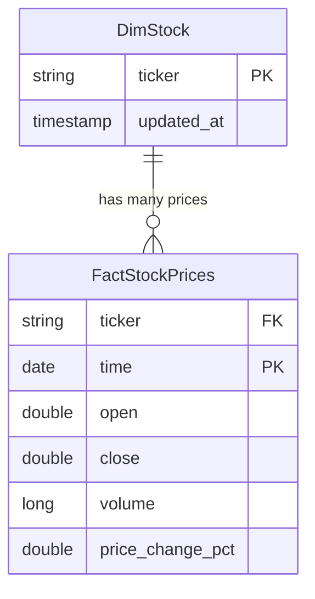

# 🚀 VN30 Stock Data Lakehouse

A professional-grade Data Lakehouse system designed to collect, process, and analyze VN30 stock data from the Vietnamese market. This project implements a modern Medallion Architecture (Bronze, Silver, Gold) using Apache Spark, Delta Lake, and Airflow, all orchestrated via Docker.

---

##  Architecture: Medallion Modeling

The pipeline follows the **Medallion Architecture** to ensure data quality and reliability:

-   ** Bronze (Raw)**: Ingests historical stock data (last 10 years) from APIs into MinIO as Parquet files, partitioned by `ingested_date`.
-   ** Silver (Cleared)**: Normalized data types, handled nulls, and removed duplicates. Data is stored in **Delta Lake** format, partitioned by `year` and `month`.
-   ** Gold (Analytics)**: High-level business aggregates and Star Schema modeling (Dim/Fact) for BI and reporting.

---

## Tech Stack

-   **Orchestration**: Apache Airflow 2.10.4
-   **Processing**: Apache Spark 3.5 (PySpark)
-   **Storage**: MinIO (S3-Compatible Object Storage)
-   **Table Format**: Delta Lake (ACID transactions, Time Travel)
-   **Metastore**: Hive Metastore (Standalone) with PostgreSQL backend
-   **Containerization**: Docker & Docker Compose

---

## Project Structure

```text
lake_house_prj/
├── airflow/            # Airflow DAGs & logs
├── config/             # Centralized configuration
│   ├── hive/           # hive-site.xml (Metastore config)
│   └── spark/          # spark-defaults.conf (S3/Delta/Hive settings)
├── src/                # Source code
│   ├── ingestion/      # Data landing & API helpers
│   ├── jobs/           # Spark transformation jobs (B -> S -> G)
│   └── main.py         # Ingestion entry point
├── docker-compose.yaml # Infrastructure orchestration
├── requirements.txt    # Python dependencies
├── .gitignore          # Git ignore rules
└── README.md           # Project documentation
```

---

## Data Model (Gold Layer)

The Gold layer implements a Star Schema for efficient querying:



---

## Getting Started

### 1. Launch Infrastructure
Start all services (MinIO, Spark, Airflow, Hive, Postgres):
```powershell
docker-compose up -d
```
-   **MinIO Console**: [http://localhost:9001](http://localhost:9001) (minioadmin/minioadmin)
-   **Airflow UI**: [http://localhost:8080](http://localhost:8080) (admin/admin)
-   **Spark UI**: [http://localhost:9090](http://localhost:9090)

### 2. Run the Pipeline
The pipeline is fully automated via Airflow. Log in to the Airflow UI and trigger the `stock_analyzer_pipeline` DAG.

**Manual Execution (Alternative):**
```powershell
# Ingest to Bronze
docker exec airflow-webserver python /opt/airflow/app/main.py

# Transform to Silver
docker exec spark-master-2 spark-submit /opt/bitnami/spark/app/jobs/bronze_to_silver.py `
    --bronze_input_path s3a://bronze/stock_data/vn30/ `
    --silver_output_path s3a://silver/stock_data/vn30/
```

---

## Maintenance & Fixes
-   **Hive Metastore**: Configured with `schema.verification=true` to prevent redundant table creation errors in Postgres.
-   **Delta Lake**: All tables in Silver/Gold layers use the Delta format to ensure ACID compliance during concurrent writes.
